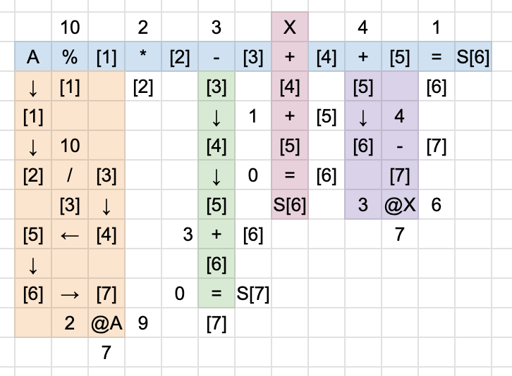
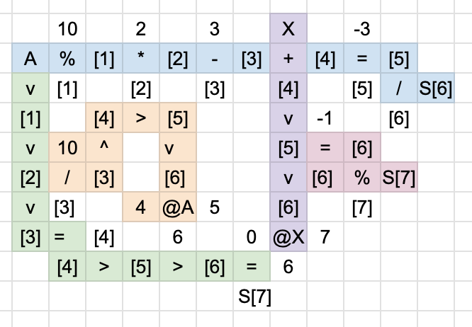
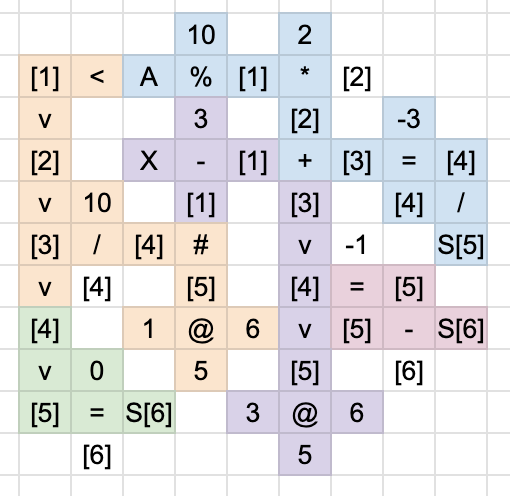

# Team Unagi

Team Unagi's repository for ICFPC 2024

## Members

- Takuya Akiba
- Kentaro Imajo
- Hiroaki Iwami
- Yoichi Iwata
- Toshiki Kataoka
- Naohiro Takahashi

## Overview

We mostly wrote our programs in Rust. The majority is CLI utilities, mainly located in `src/bin`.

## ICFP language

* `src/eval.rs` Parsing and evaluation. The byte positions of the source code were also recorded for debugging purposes.

* `src/pp.rs` Integers and strings were made writable in their usual notation.

## Lambdaman

We created solutions depending on the problem properties, employing several approaches:

* Manually creating solutions
* Random walks

For the random walk program, we used a linear congruential generator. We automatically searched for parameters (initial value, coefficient, modulus, etc.) that could reach all points. (`src/iwiwi_rev-lcg_v2.rs`)

## Spaceship

Implemented the following two types of solvers:
A beam search solver that optimizes the order of traversal. The state consists of (position, velocity, set of visited points), and to ensure diversity, the velocity is limited to three types: minimum, maximum, and minimum absolute value for each axis.
A beam search solver that fixes the order of traversal and optimizes acceleration. The state consists only of velocity, so all small differences in velocity are preserved. The order was calculated based on the current best solution or by reducing it to a TSP.
The calculation of acceleration to move exactly to the target point can be done independently for the x-axis and y-axis by fixing the travel time. The travel time is constrained by the minimum time to reach the point + delta. Code: `spaceship/solution/src/bin/*.rs`

## 3D

We solved everything manually.

## Efficiency

The most difficult part was deciphering the given program and understanding its intent. For this, GPT-4 and Claude 3.5 sonnet were extremely useful. Once we understood the intent, we were able to solve it by reimplementing a program that could perform the same calculations efficiently. For some problems, we utilized z3.

## Lightning Round

> please include a small README giving an overview of the solution and which parts were written during the first 24 hours of the contest.

For more details, refer to the GitHub history.

In 24 hours, we aimed to make minimum submissions for all problems. This was due to the scoring design of the contest. For Lambdaman, we created a program using DFS to find a method to visit all vertices (`src/bin/chokudai.rs`). For Spaceship, we implemented a basic greedy algorithm. For 3D, we manually created the solutions. We were able to solve all problems for Efficiency within 24 hours.
